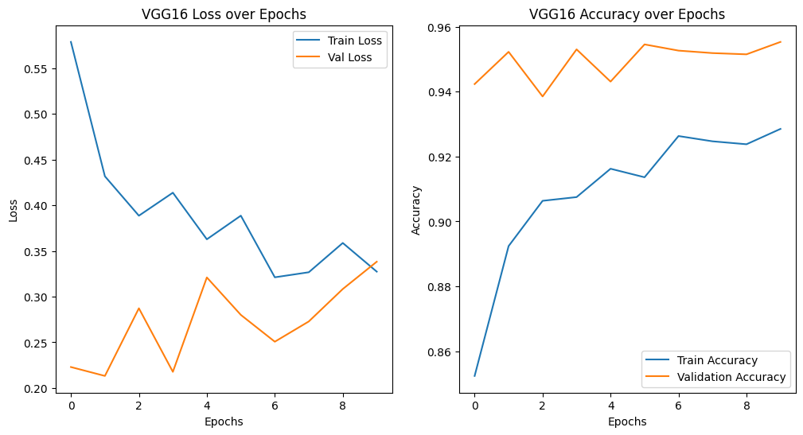
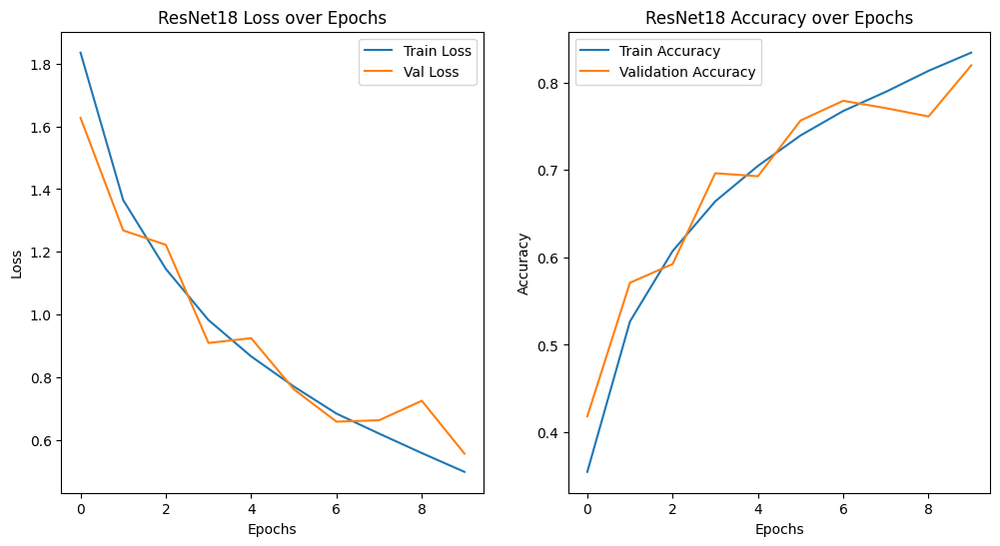
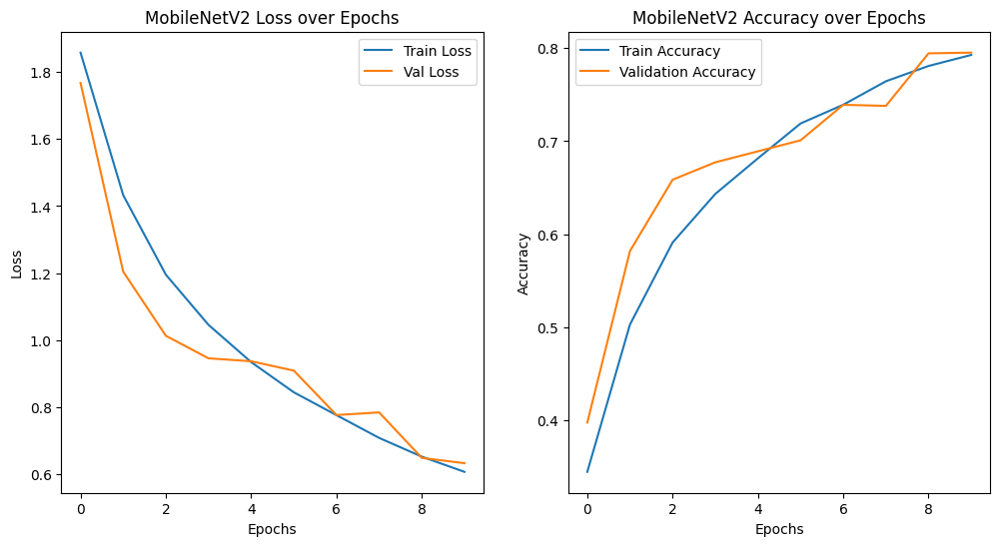
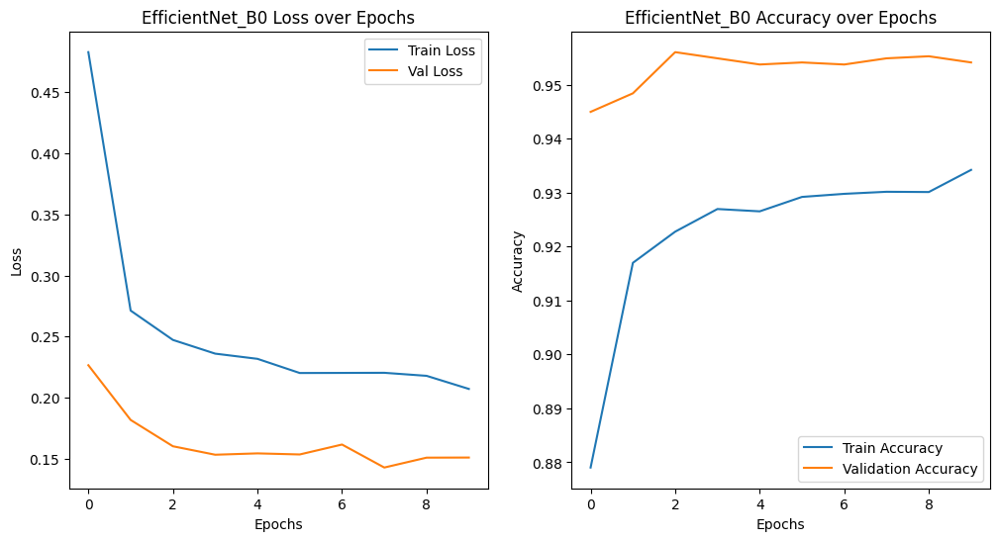
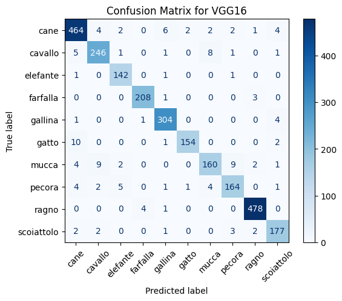
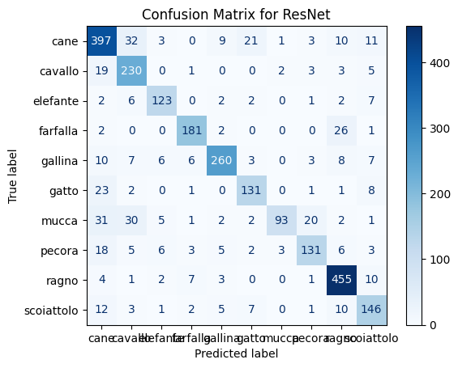
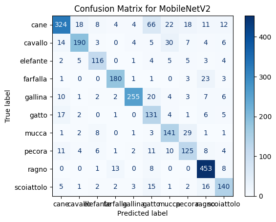
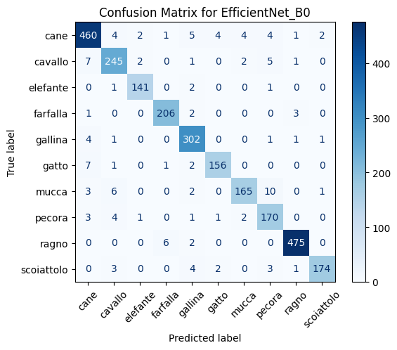

# Animal Image Classification using CNN

This project implements image classification using Convolutional Neural Networks (CNNs) with both custom and transfer learning models: VGG16, ResNet, MobileNet, and EfficientNet.

---

## 📂 Dataset
The dataset contains multiple classes of animal images used for training and evaluation.
The dataset used for this project is available on Kaggle:  
[Animal Dataset – Kaggle](https://www.kaggle.com/datasets/parveenkaur17/animal-datasets-1)

---

##  Kaggle Notebook
View and run the full notebook on Kaggle:  
[Animal Image Classification Using CNNs](https://www.kaggle.com/code/parveenkaur17/animal-image-classification-using-cnns)

---

##  My Kaggle Profile
Explore my other datasets and notebooks here:  
[Parveen Kaur on Kaggle](https://www.kaggle.com/parveenkaur17)

---

## 🛠 Models Used
- VGG16 (Transfer Learning)
- ResNet (Transfer Learning)
- MobileNet (Transfer Learning)
- EfficientNet (Transfer Learning)

---

## 📊 Results

### Accuracy & Loss Graphs





### Confusion Matrices





---

## 🚀 How to Run
1. Clone the repo:
   ```bash
   git clone https://github.com/kaurparveen1719-creator/animal-image-classification-cnn.git
